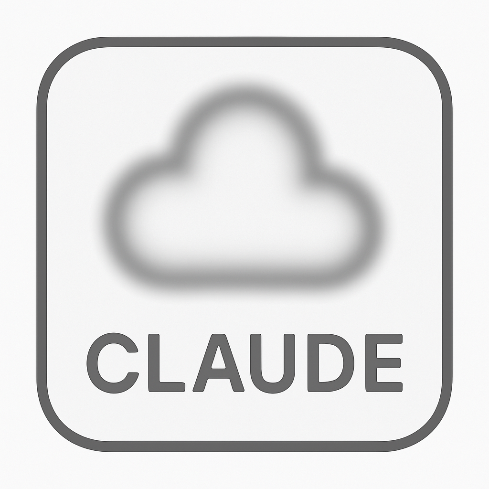

# Claude Privacy Helper

A Chrome extension that adds privacy controls to Claude AI, allowing you to blur chat titles and conversation names for enhanced privacy.



## Features

- **🔒 Smart Blur Control**: Blur chat titles in sidebar and main conversation area
- **⚡ Quick Toggle**: Floating button for instant privacy activation
- **🎛️ Adjustable Intensity**: Customize blur level from 1-10
- **👁️ Hover to Peek**: Reduced blur on hover for quick access
- **🎯 Intelligent Targeting**: Only blurs chat content, keeps navigation clear
- **💾 Auto-Save Settings**: Remembers your preferences

## What Gets Blurred

✅ **Blurred Content**
- Sidebar chat titles (starred & recent)
- Main conversation titles
- Chat history names

❌ **Stays Clear**
- "New chat" button
- "Chats" navigation
- "Projects" section
- Settings and controls

## Installation

### Chrome Web Store (Coming Soon)
1. Visit Chrome Web Store
2. Search "Claude Privacy Helper"
3. Click "Add to Chrome"

### Manual Installation
1. Download or clone this repository
2. Open Chrome and go to `chrome://extensions/`
3. Enable "Developer mode" (top right)
4. Click "Load unpacked"
5. Select the extension folder

## Usage

### Quick Toggle
- Look for the floating 🔒/👁️ button at bottom-right
- Click to instantly enable/disable blur
- Button shows current state (🔒 = active, 👁️ = inactive)

### Settings Panel
1. Click the extension icon in Chrome toolbar
2. Use toggle switch to enable/disable blur
3. Adjust blur intensity slider (1-10)
4. Settings save automatically

### Keyboard Shortcut (Optional)
Go to `chrome://extensions/shortcuts` to set a custom hotkey.

## Privacy & Security

- **Local Only**: All data stored locally on your device
- **No Tracking**: Extension doesn't collect any user data
- **Minimal Permissions**: Only accesses Claude.ai domain
- **Open Source**: Full source code available for review

## Compatibility

- **Browser**: Chrome 88+ (Manifest V3 compatible)
- **Website**: Works exclusively on claude.ai
- **Updates**: Auto-updates when installed from Chrome Web Store

## Development

### File Structure
```
claude-privacy-helper/
├── manifest.json          # Extension configuration
├── content.js            # Main functionality
├── popup.html           # Settings interface
├── popup.js             # Settings logic
├── blur.css             # Blur styling
├── icons/               # Extension icons
└── README.md           # This file
```

### Key Functions
- `blurChatElements()` - Applies blur to target elements
- `createFloatingButton()` - Creates quick toggle button
- `shouldBlurElement()` - Smart content detection

### Contributing
1. Fork the repository
2. Create feature branch (`git checkout -b feature/amazing-feature`)
3. Commit changes (`git commit -m 'Add amazing feature'`)
4. Push to branch (`git push origin feature/amazing-feature`)
5. Open Pull Request

## Troubleshooting

**Blur not working?**
- Refresh the Claude.ai page
- Check if extension is enabled
- Try toggling blur off/on

**Button not visible?**
- Check if you're on claude.ai
- Look for button at bottom-right corner
- Extension only works on Claude domains

**Settings not saving?**
- Ensure Chrome has storage permissions
- Check if extension has proper permissions

## License

MIT License - see LICENSE file for details.

## Changelog

### v1.0.0
- Initial release
- Basic blur functionality
- Floating toggle button
- Adjustable blur intensity
- Smart content detection

## Support

Found a bug or have a suggestion?
- Open an issue on GitHub
- Include Chrome version and steps to reproduce

---

**Made with ❤️ for Claude AI users who value privacy**