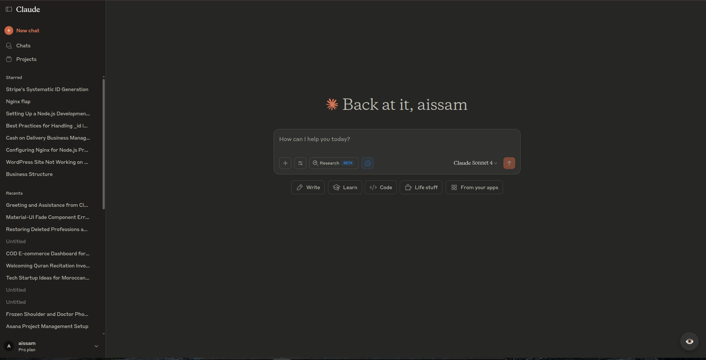
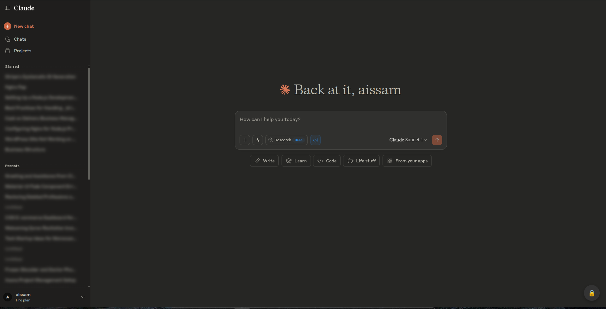
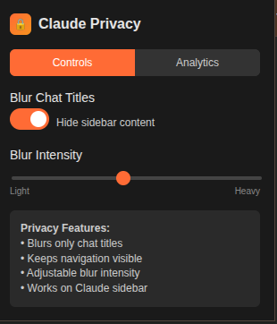

# Claude Chat Privacy

🔒 **Privacy protection for Claude AI conversations** - Keep your chat history private during screen sharing and presentations.

  

## ✨ Features

- **🎯 Smart Selective Blur**: Only blurs chat titles, keeps navigation clear
- **⚡ Quick Toggle**: Floating button for instant privacy control
- **🎛️ Adjustable Intensity**: 10 blur levels from subtle to complete privacy
- **👁️ Hover to Peek**: Temporarily reduce blur for quick access
- **💾 Auto-Save Settings**: Preferences persist across sessions
- **📊 Usage Analytics**: Track your privacy habits (stored locally only)
- **🛡️ Zero Data Collection**: Complete privacy, no external tracking

## 🖼️ Screenshots

### Before & After
| Normal View | Privacy Enabled |
|-------------|-----------------|
|  |  |

### Control Interface


## 🚀 Quick Start

### Chrome Web Store (Recommended)
1. Visit [Claude Chat Privacy on Chrome Web Store](https://chromewebstore.google.com/detail/claude-chat-privacy/gfaolkdjhgabdeibppikbkimeipgbcep?utm_source=item-share-cb)
2. Click "Add to Chrome"
3. Visit claude.ai and look for the floating 🔒 button

### Manual Installation
1. Download the [latest release](releases) or clone this repo
2. Open Chrome → `chrome://extensions/`
3. Enable "Developer mode" (top right)
4. Click "Load unpacked" → Select extension folder
5. Visit claude.ai to activate

## 📖 How to Use

### Quick Toggle Method
1. **Visit claude.ai** - Extension activates automatically
2. **Find the floating button** - Look for 🔒/👁️ at bottom-right
3. **Click to toggle** - Instantly enable/disable privacy blur
4. **Adjust if needed** - Click extension icon for intensity settings

### Settings Panel
1. **Click extension icon** in Chrome toolbar
2. **Toggle blur on/off** with the main switch
3. **Adjust intensity** using the 1-10 slider
4. **View analytics** in the Analytics tab

### What Gets Blurred
✅ **Protected Content:**
- Sidebar chat titles (starred & recent)
- Main conversation headers
- Chat history references

❌ **Always Clear:**
- "New Chat" button
- Navigation menus
- Settings and controls

## 🔧 Advanced Features

### Analytics Dashboard
Track your privacy usage with local analytics:
- **Privacy Score**: Overall privacy rating (0-100)
- **Protected Hours**: Total time with blur active
- **Usage Patterns**: Daily, weekly, monthly trends
- **Session Stats**: Average session duration and toggle frequency

### Keyboard Shortcuts (Optional)
Set custom hotkeys in `chrome://extensions/shortcuts`:
- Quick toggle blur on/off
- Cycle through intensity levels
- Open settings panel

## 🛡️ Privacy & Security

### What We Don't Collect
- ❌ No chat content or conversations
- ❌ No personal information
- ❌ No browsing history
- ❌ No external data transmission

### What We Store Locally
- ✅ Blur enabled/disabled preference
- ✅ Intensity level (1-10)
- ✅ Usage analytics (local only)
- ✅ Session timing data

### Permissions Explained
- **`storage`**: Save your blur preferences locally
- **`activeTab`**: Apply blur effects on claude.ai
- **`https://claude.ai/*`**: Only works on Claude domain

## 🔍 Technical Details

### Browser Compatibility
- **Chrome 88+** (Manifest V3)
- **Edge 88+** (Chromium-based)
- **Brave Browser** (Latest)
- **Opera** (Chromium-based)

### Performance
- **Lightweight**: <50KB total size
- **Fast Loading**: <100ms initialization
- **Memory Efficient**: Minimal RAM usage
- **CPU Friendly**: No background processing

### Architecture
```
claude-privacy-extension/
├── manifest.json          # Extension configuration
├── content.js            # Main blur logic & DOM manipulation
├── popup.html           # Settings interface
├── popup.js             # Settings logic & analytics
├── blur.css             # Blur effects & animations
├── icons/               # Extension icons (16px, 48px, 128px)
└── README.md           # This documentation
```

## 🛠️ Development

### Setup Development Environment
```bash
git clone https://github.com/nexus-aissam/claude-privacy-extension.git
cd claude-privacy-extension
```

### Key Functions
- **`ClaudePrivacy.blurChatElements()`** - Applies selective blur to chat titles
- **`createFloatingButton()`** - Creates the quick toggle interface
- **`shouldBlurElement()`** - Smart detection of blurable content
- **`loadAnalytics()`** - Calculates privacy usage statistics

### Testing
1. Load extension in developer mode
2. Navigate to claude.ai
3. Test blur toggle functionality
4. Verify intensity adjustments
5. Check analytics tracking

### Contributing
1. Fork the repository
2. Create feature branch (`git checkout -b feature/amazing-feature`)
3. Commit changes (`git commit -m 'Add amazing feature'`)
4. Push to branch (`git push origin feature/amazing-feature`)
5. Open Pull Request

## 📊 Analytics Features

### Privacy Score Calculation
- **Usage Rate**: Hours protected vs. total usage
- **Consistency**: Regular privacy activation patterns
- **Range**: 0-100 (higher = better privacy habits)

### Usage Tracking
- **Session Duration**: Time with blur active
- **Toggle Frequency**: How often privacy is activated
- **Patterns**: Daily, weekly, monthly usage trends
- **All data stored locally only**

## 🔄 Changelog

### v1.0.0 (Current)
- ✅ Initial release
- ✅ Smart blur targeting
- ✅ Floating toggle button
- ✅ Adjustable intensity (1-10 levels)
- ✅ Hover-to-peek functionality
- ✅ Local analytics dashboard
- ✅ Auto-save preferences

### Planned Features
- 🔮 Multiple blur modes (pixelate, overlay)
- 🔮 Custom blur areas
- 🔮 Keyboard shortcuts
- 🔮 Dark/light theme detection
- 🔮 Multiple profile support

## 🐛 Troubleshooting

### Common Issues

**Blur not working?**
- Refresh claude.ai page
- Check if extension is enabled in `chrome://extensions/`
- Try toggling blur off and on again

**Button not visible?**
- Ensure you're on claude.ai (not claude.anthropic.com)
- Check bottom-right corner of page
- Extension only activates on Claude domains

**Settings not saving?**
- Verify Chrome storage permissions
- Check for browser storage quota issues
- Try clearing extension data and reconfiguring

**Performance issues?**
- Reduce blur intensity for better performance
- Disable analytics tracking if needed
- Ensure Chrome is up to date

### Getting Help
- 📧 **Email**: Open issue on GitHub
- 💬 **Discussions**: GitHub Discussions tab
- 🐛 **Bug Reports**: GitHub Issues with reproduction steps
- 💡 **Feature Requests**: GitHub Issues with enhancement label

## 📄 License

MIT License - see [LICENSE](LICENSE) file for details.

## 🙏 Acknowledgments

- **Claude AI** - For creating an amazing AI assistant
- **Chrome Extensions Team** - For excellent documentation
- **Privacy Community** - For inspiration and feedback
- **Beta Testers** - For valuable testing and suggestions

## 📈 Stats


---

**Made with ❤️ for Claude AI users who value privacy**

*Protect your conversations, maintain your privacy, stay productive.*